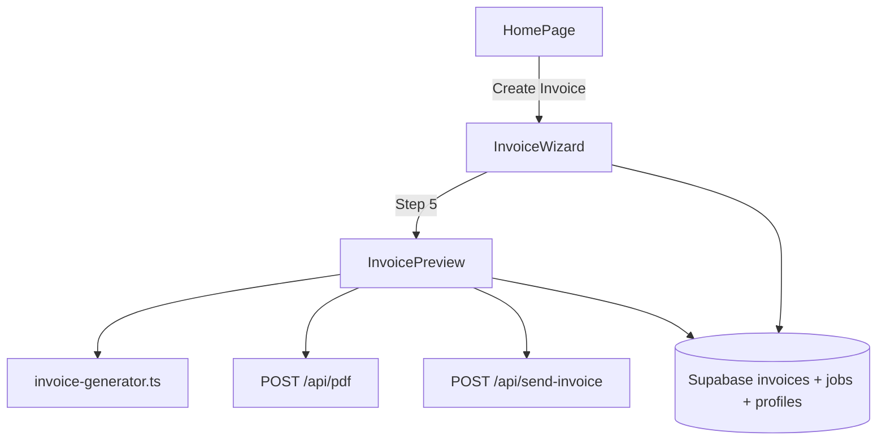

# Invoice generator (wizard + PDF + Resend)

## Release / git discipline (mandatory)

- **Do not `git commit` this feature (or any part of it) until the user explicitly instructs you to commit.**  
- Local development and testing are fine; treat commits as blocked by default.

---

## Architecture (high level)

- Reuse the same PDF pipeline as `[AgreementPreview.tsx](src/components/AgreementPreview.tsx)`: build HTML string (or `outerHTML` from a ref), `fetch('/api/pdf', { html, filename, ... })` — see `[fetchPdfBlob](src/components/AgreementPreview.tsx)` (~164–188).
- Extend the PDF API contract so the **margin header left label** can be an **invoice number** (PDF-only), not only `Work Order #…` — today `[server/app-server.mjs](server/app-server.mjs)` uses `workOrderNumber` in `[buildHeaderTemplate](server/app-server.mjs)` (~88–104). Prefer a **single optional string** (e.g. `marginHeaderLeft`) with backward-compatible fallback to existing `workOrderNumber` so WO PDFs stay unchanged.

---

## Database

**New migration** (e.g. `[supabase/migrations/0002_invoices.sql](supabase/migrations/0002_invoices.sql)`) — keep `[0001_initial_schema.sql](supabase/migrations/0001_initial_schema.sql)` unchanged for hygiene unless you intentionally refresh the squashed baseline later:

- `CREATE TABLE invoices` per your spec (`line_items jsonb`, tax fields, `payment_status`, FK `job_id` → `jobs`, `user_id` → `auth.users`).
- `ALTER TABLE business_profiles ADD COLUMN next_invoice_number integer NOT NULL DEFAULT 1;`
- Indexes: `(user_id)`, `(job_id)` as needed for list/filter.
- **RLS**: mirror `[0001_initial_schema.sql](supabase/migrations/0001_initial_schema.sql)` jobs/clients pattern — `user_id = auth.uid()` for select/insert/update/delete.
- **Triggers**: `moddatetime(updated_at)` on `invoices` (extension already enabled in 0001).

**TypeScript**: add `Invoice` (and line-item types) in `[src/types/db.ts](src/types/db.ts)`; extend `BusinessProfile` with `next_invoice_number`.

---

## Profile counter (mirror WO)

- Add `updateNextInvoiceNumber(userId, next)` in `[src/lib/db/profile.ts](src/lib/db/profile.ts)` — same `**.update()`-only** approach as `[updateNextWoNumber](src/lib/db/profile.ts)` (~24–36).
- After **successful** invoice persist + user-facing success (same spirit as `[handleSaveSuccess](src/App.tsx)` for WO), bump local profile state and call `updateNextInvoiceNumber`.

---

## Data access

- New `[src/lib/db/invoices.ts](src/lib/db/invoices.ts)`: `createInvoice`, `updateInvoice`, `listInvoices` (and `getInvoice(id)` if useful for Step 5 reload). Follow error handling style of `[src/lib/db/jobs.ts](src/lib/db/jobs.ts)`.
- Step 1 list: reuse `[listJobs](src/lib/db/jobs.ts)` (already `user_id`-scoped) or add a thin `listJobsForInvoicePicker` if you need a smaller `select()` for performance — map rows to **WO#** (`wo_number`), **customer_name**, **job_type**, **date** (use `agreement_date` if set, else `created_at` — document the choice in code comment).

---

## Invoice HTML / calculations

- New `[src/lib/invoice-generator.ts](src/lib/invoice-generator.ts)`: **pure function** that returns preview markup (no React) from `(invoiceDraft | Invoice, job: Job, profile: BusinessProfile | null)`:
  - **Parties table**: same visual pattern as agreement `[partiesLayout](src/lib/agreement-generator.ts)` rendering (reuse markup/CSS classes where possible — `[AgreementPreview` `buildPdfHtml](src/components/AgreementPreview.tsx)` already inlines `App.css` for PDF).
  - **Line items**: table Description | Qty | Unit Price | Total.
  - **Due date** prominent above totals.
  - **Subtotal / Tax 6% / Total** right-aligned; tax **not editable** — `tax_rate = 6`, `tax_amount = subtotal * 0.06`, `total = subtotal + tax_amount`.
  - **Notes** section if `notes` present.
  - **No signature block.**

---

## Wizard UX (`[src/components/InvoiceWizard.tsx](src/components/InvoiceWizard.tsx)`)

- Container owns **step index** and **draft state** (selected `jobId`, pricing branch fields, `due_date`, `notes`, computed `subtotal`/`line_items`).
- **Step 1 — Select WO**: list from DB; on select, load full `Job` row if needed and **pre-fill** draft (customer-facing fields, default amounts from `job.price` where relevant, `customer_email` from job for later Resend prompt).
- **Step 2 — Pricing**:
  - If `price_type === 'fixed'`: **skip** labor/materials sub-steps; one screen — confirm/edit total vs WO# label; **Confirm** → Step 3.
  - If `estimate` or `time_and_materials`: **2a** labor (hours × rate, live total, **skip** if not billing hourly), **2b** materials Yes/No + dynamic rows (description, qty, unit price, line total). Persist structure into `line_items` jsonb in a consistent schema (e.g. `{ kind: 'labor'|'material', ... }[]` or separate arrays merged at save).
- **Step 3 — Due date**: date input, default **today + 14 days**.
- **Step 4 — Notes**: optional textarea + prominent **Skip**.
- **Step 5**: render `[InvoicePreview](src/components/InvoicePreview.tsx)` (or embed as final step body).

---

## Preview / PDF / send (`[src/components/InvoicePreview.tsx](src/components/InvoicePreview.tsx)`)

- Mirror `[AgreementPreview.tsx](src/components/AgreementPreview.tsx)`: scale-to-fit preview container, ref on document root, `buildPdfHtml` equivalent for invoice (import `App.css?raw` + same font link block as agreement PDF).
- **Download & Send**:
  1. Validate draft (minimum: job linked, totals consistent, `invoice_date` default today).
  2. **Insert** `invoices` row with `invoice_number` from `profile.next_invoice_number` (or insert then use returned row — match how WO assigns `wo_number` from draft).
  3. `**updateNextInvoiceNumber`** on success (with error banner pattern like `[woCounterPersistError](src/App.tsx)` if desired).
  4. Call `/api/pdf` with **invoice margin header** string (e.g. `Invoice #0001`) — **never** show invoice# in wizard chrome / preview tab title (only inside PDF body if needed for parity, or rely on margin only per your spec — spec says PDF margin only; keep wizard/preview free of invoice#).
  5. Download blob (same object-URL pattern as `[downloadPdfBlob](src/components/AgreementPreview.tsx)`).
  6. If `job.customer_email` (from selected WO) present: `window.confirm` / small modal — **Send to [email]?** On confirm → `POST /api/send-invoice` with PDF bytes + metadata.

---

## Server (`[server/app-server.mjs](server/app-server.mjs)`)

- **PDF**: extend JSON body to accept invoice header label (recommend `marginHeaderLeft`); thread into `buildHeaderTemplate` / `page.pdf` path (~133–175). Keep existing WO behavior.
- **Resend**: add dependency (`resend` package); read `process.env.RESEND_API_KEY`.
- `**POST /api/send-invoice`**: JSON body e.g. `{ to, subject, text, pdfBase64, filename }` (or multipart if you prefer); verify basic validation; call Resend **attachments**. Use **from** address compatible with Resend (document in comment — often verified domain).
- Add `[RESEND_API_KEY](.env.example)` (and document `RESEND_FROM` or similar if required).

---

## App / Home navigation

- `[HomePage.tsx](src/components/HomePage.tsx)`: second button **Create Invoice** under Create Work Order; new prop `onCreateInvoice`.
- `[App.tsx](src/App.tsx)`: extend `view` (e.g. `'invoice'` or `'invoice-wizard'`) and optional tab bar **only when** in invoice flow (same pattern as `showTabs` for form/preview ~294–308). Pass `user`, `profile`, callbacks to wizard.
- On invoice exit, return to `home` (and reset wizard state).

---

## Docs

- Update `[ARCHITECTURE.md](ARCHITECTURE.md)` briefly: invoices table, counter, PDF/Resend endpoints, wizard entry from home.

---

## Testing checklist (manual)

- Fixed / estimate / T&M branches all reach Step 5 with sensible totals and 6% tax.
- Invoice# appears **only** in PDF margin header, not wizard UI.
- Save increments `next_invoice_number` once per successful invoice save.
- Resend only offered when email exists; cancel skips send.
- RLS: other user cannot read/write invoices.

