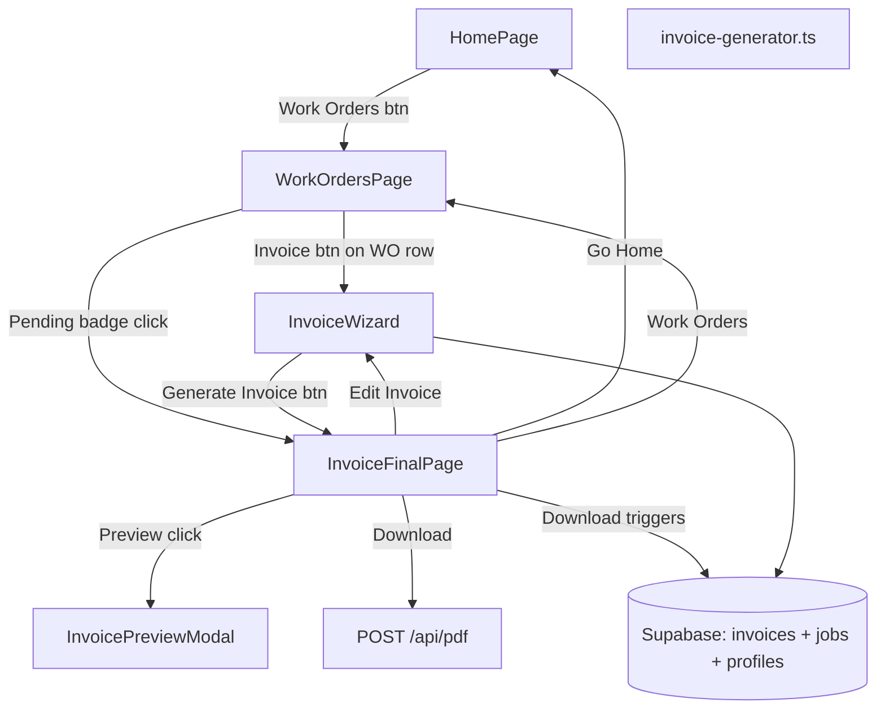

# Invoice Generator — Final Build Spec

## Release / git discipline (mandatory)

- **Do not `git commit` this feature (or any part of it) until the user explicitly instructs you to commit.**
- Local development and testing are fine; treat commits as blocked by default.

---

## Architecture (high level)




### Key reuse points

- Same PDF pipeline as `AgreementPreview.tsx`: build HTML string, `fetch('/api/pdf', { html, filename, ... })`.
- Extend PDF API contract so margin header accepts a generic `marginHeaderLeft` string (e.g. `"Invoice #0001"`), with backward-compatible fallback to existing `workOrderNumber` so WO PDFs stay unchanged.

---

## Database

### New migration: `supabase/migrations/0002_invoices.sql`

Keep `0001_initial_schema.sql` unchanged.

`**invoices` table:**

```sql
CREATE TABLE invoices (
  id            uuid PRIMARY KEY DEFAULT gen_random_uuid(),
  user_id       uuid NOT NULL REFERENCES auth.users(id) ON DELETE CASCADE,
  job_id        uuid NOT NULL REFERENCES jobs(id) ON DELETE CASCADE,
  invoice_number integer NOT NULL,
  invoice_date   date NOT NULL DEFAULT CURRENT_DATE,
  due_date       date NOT NULL,
  status         text NOT NULL DEFAULT 'draft' CHECK (status IN ('draft', 'downloaded')),
  line_items     jsonb NOT NULL DEFAULT '[]'::jsonb,
  subtotal       numeric(10,2) NOT NULL DEFAULT 0,
  tax_rate       numeric(5,4) NOT NULL DEFAULT 0.06,
  tax_amount     numeric(10,2) NOT NULL DEFAULT 0,
  total          numeric(10,2) NOT NULL DEFAULT 0,
  payment_methods jsonb NOT NULL DEFAULT '[]'::jsonb,
  notes          text,
  created_at     timestamptz NOT NULL DEFAULT now(),
  updated_at     timestamptz NOT NULL DEFAULT now()
);
```

**Column notes:**

- `status`: `'draft'` = created when user hits "Generate Invoice" on step 3. `'downloaded'` = flipped when user clicks "Download Invoice" on final page.
- `tax_rate`: Stored as the actual rate used (default 0.06 = 6%). Not derived. Editable / profile-configurable in the future.
- `line_items`: JSONB array, single array with `kind` discriminator. Schema: `{ kind: 'labor' | 'material', description: string, qty: number, unit_price: number, total: number }[]`.
- `payment_methods`: JSONB array copied from profile at invoice creation time (snapshot, not live reference).
- `notes`: Optional. Added from final page "Add Notes" feature.

**Atomic invoice number function:**

```sql
CREATE OR REPLACE FUNCTION next_invoice_number(p_user_id uuid)
RETURNS integer
LANGUAGE plpgsql
AS $$
DECLARE
  v_next integer;
BEGIN
  UPDATE business_profiles
  SET next_invoice_number = next_invoice_number + 1
  WHERE user_id = p_user_id
  RETURNING next_invoice_number - 1 INTO v_next;

  RETURN v_next;
END;
$$;
```

This atomically reads and increments in a single UPDATE — no race condition. Returns the number to use (pre-increment value). Called during invoice creation.

**Profile column:**

```sql
ALTER TABLE business_profiles
  ADD COLUMN next_invoice_number integer NOT NULL DEFAULT 1;
```

**Indexes:**

```sql
CREATE INDEX idx_invoices_user_id ON invoices(user_id);
CREATE INDEX idx_invoices_job_id ON invoices(job_id);
```

**RLS:** Mirror jobs/clients pattern from `0001_initial_schema.sql`:

```sql
ALTER TABLE invoices ENABLE ROW LEVEL SECURITY;

CREATE POLICY "Users can manage own invoices"
  ON invoices FOR ALL
  USING (user_id = auth.uid())
  WITH CHECK (user_id = auth.uid());
```

**Trigger:**

```sql
CREATE TRIGGER handle_invoices_updated_at
  BEFORE UPDATE ON invoices
  FOR EACH ROW
  EXECUTE FUNCTION moddatetime(updated_at);
```

---

## TypeScript Types

In `src/types/db.ts`:

```typescript
export interface InvoiceLineItem {
  kind: 'labor' | 'material';
  description: string;
  qty: number;
  unit_price: number;
  total: number;
}

export interface Invoice {
  id: string;
  user_id: string;
  job_id: string;
  invoice_number: number;
  invoice_date: string;
  due_date: string;
  status: 'draft' | 'downloaded';
  line_items: InvoiceLineItem[];
  subtotal: number;
  tax_rate: number;
  tax_amount: number;
  total: number;
  payment_methods: string[];
  notes: string | null;
  created_at: string;
  updated_at: string;
}
```

Extend `BusinessProfile` with `next_invoice_number: number`.

---

## Data Access: `src/lib/db/invoices.ts`

Follow error handling style of `src/lib/db/jobs.ts`.

- `**createInvoice(draft)**`: Calls `next_invoice_number()` DB function to get invoice number, then inserts row with `status: 'draft'`. Returns created invoice.
- `**updateInvoice(id, data)**`: Full-row overwrite (not per-field patch). Replaces the entire row to prevent stale data. Used when user edits and re-saves.
- `**markInvoiceDownloaded(id)**`: Sets `status = 'downloaded'`. Called after successful PDF download.
- `**listInvoices(userId)**`: Returns all invoices for user.
- `**getInvoice(id)**`: Single invoice fetch (for reloading pending invoices).
- `**getInvoiceByJobId(jobId)**`: Returns invoice for a given job if one exists (for badge logic on WO list).

No `updateNextInvoiceNumber` in `profile.ts` — the DB function handles it atomically.

---

## Invoice HTML: `src/lib/invoice-generator.ts`

Pure function returning HTML string (no React). Signature:

```typescript
function generateInvoiceHtml(
  invoice: Invoice | InvoiceDraft,
  job: Job,
  profile: BusinessProfile | null
): string
```

**Content sections (top to bottom):**

1. **Parties table**: Same visual pattern as agreement `partiesLayout` (reuse markup/CSS classes). Business info left, customer info right.
2. **Invoice details**: Invoice date, due date.
3. **Line items table**: Description | Qty | Unit Price | Total. All items from single `line_items` array, grouped visually by `kind` if desired (labor rows first, then materials).
4. **Totals block** (right-aligned): Subtotal, Tax (rate% shown), **Total** bold.
5. **Payment methods**: List of accepted payment methods, properly formatted.
6. **Notes**: Rendered at bottom if present.
7. **No signature block.**

Tax calculation: `tax_amount = subtotal * tax_rate`, `total = subtotal + tax_amount`. Tax rate stored on invoice row, not derived.

---

## Server: `server/app-server.mjs`

### PDF endpoint changes

Extend JSON body to accept `marginHeaderLeft` (optional string). Thread into `buildHeaderTemplate` / `page.pdf` path (~133–175).

**Backward compatibility:** If `marginHeaderLeft` is provided, use it. Otherwise fall back to existing `workOrderNumber` behavior. WO PDFs stay unchanged.

Example body for invoice PDF:

```json
{
  "html": "...",
  "filename": "Invoice_0001.pdf",
  "marginHeaderLeft": "Invoice #0001"
}
```

### No Resend / email integration (backburnered)

Verified domain requirement is too much friction for MVP. No `/api/send-invoice` endpoint. No Resend dependency. Users download the PDF and email it themselves. Revisit later when there's a clear UX path (e.g., settings page for email integration).

---

## Work Orders Page: `src/components/WorkOrdersPage.tsx`

New page listing all work orders for the user, ordered by `created_at` descending (newest first).

**Entry point:** "Work Orders" button on `HomePage.tsx`, positioned top-right of the homepage content area (not in the app header).

**Each WO row displays:**

- WO number, customer name, job type, date
- **Right side — one of three badge states:**
  - **Blue "Invoice" button**: No invoice exists for this WO. Clicking launches `InvoiceWizard` pre-filled from this WO.
  - **Yellow/amber "Pending" badge**: A draft invoice exists (`status: 'draft'`). Clickable — takes user directly to `InvoiceFinalPage` with all their previous inputs loaded.
  - **Green "Invoiced" badge**: Invoice has been downloaded (`status: 'downloaded'`). Not clickable (or clickable to view details — future enhancement).

**Badge state logic:** On page load, fetch `listInvoices(userId)` and cross-reference by `job_id` to determine which WOs have invoices and their status.

---

## Invoice Wizard: `src/components/InvoiceWizard.tsx`

3-step wizard. No "Select WO" step — the wizard is always launched from a specific WO on the Work Orders page, so the job is already known.

Container owns step index and draft state (pricing fields, `due_date`, `notes`, computed `subtotal` / `line_items`).

### Step 1 — Pricing

Pre-filled from WO data. Behavior depends on `price_type`:

- `**fixed`**: Single screen — confirm/edit the total amount vs WO label. One line item of `kind: 'labor'` with the fixed price. **Confirm** → Step 2.
- `**estimate`** or `**time_and_materials`**: Two sub-steps:
  - **1a — Labor**: Hours × rate, live total. **Skip** button if not billing hourly. Generates line item(s) of `kind: 'labor'`.
  - **1b — Materials**: Yes/No toggle. If Yes → dynamic rows (description, qty, unit price, line total). Each row = `kind: 'material'` line item. **Skip** if no materials.
  - Selected pricing type determines which path. Amounts entered override whatever was on the WO.

All line items stored in single `line_items` JSONB array with `kind` discriminator.

### Step 2 — Due Date

Date input. Default: **today + 14 days**.

### Step 3 — Payment Methods

Displays the same payment methods from the user's profile, properly formatted for both mobile and desktop. User confirms which methods to include on this invoice (checkboxes or similar).

**Button at bottom: "Generate Invoice"**

On click:

1. Call `createInvoice()` — which calls the `next_invoice_number()` DB function atomically, inserts row with `status: 'draft'`.
2. Navigate to `InvoiceFinalPage`.

---

## Invoice Final Page: `src/components/InvoiceFinalPage.tsx`

This is the confirmation / action page after the invoice draft is created.

### Layout (top to bottom):

**Navigation row:**

- Top-left: **"Go Home"** button
- Top-right: **"Work Orders"** button

**Heading:**

- Large heading: **"Invoice #0001 Ready"** (using actual invoice number, zero-padded to 4 digits)

**Mini preview box:**

- Scaled-down render of the invoice HTML (same `transform: scale()` + overflow-hidden approach as `AgreementPreview.tsx`).
- **Clickable** — opens `InvoicePreviewModal` (full-screen paginated preview).
- Particularly useful on mobile for a quick visual check.

**Action buttons (below mini preview):**

- **"Preview Invoice"** — redundant with clickable mini preview, so **omit**. The mini preview box handles this.
- **"Download Invoice"** — Primary action. Blue button. On click:
  1. Call `/api/pdf` with invoice HTML and `marginHeaderLeft: "Invoice #0001"`.
  2. Download PDF blob (same object-URL pattern as `downloadPdfBlob` in `AgreementPreview.tsx`).
  3. Call `markInvoiceDownloaded(id)` to flip status to `'downloaded'`.
  4. Redirect to **Work Orders page** with temporary green success banner: **"Invoice #0001 downloaded and saved!"** (fades after ~5 seconds or has dismiss X). The WO now shows green "Invoiced" badge.
- **"Edit Invoice"** — Full-width button below Download. Takes user back to Step 1 of wizard with all fields pre-filled from current draft. On re-save, calls `updateInvoice()` with **full row overwrite** (not per-field). If invoice was already downloaded, re-editing and re-downloading is fine — same row, same invoice number.

**Add Notes:**

- Small text link/button below Edit Invoice.
- On click: expands an inline textarea.
- User types notes, clicks "Save Notes" (or similar confirm).
- Notes are saved to the draft via `updateInvoice()`.
- Notes appear in the mini preview and in the PDF (at the bottom of the invoice).
- Notes remain editable — user can re-open, modify, and re-save freely until they're done.

**Invoice number visibility rule:** Invoice number appears in the PDF margin header (`marginHeaderLeft`) and in the final page heading. It does NOT appear in wizard step chrome or step titles.

---

## Invoice Preview Modal: `src/components/InvoicePreviewModal.tsx`

Full-screen modal overlay triggered by clicking the mini preview box on the final page.

**Requirements:**

- **Paginated print-preview style**: Show the invoice broken up by page boundaries (like browser print preview), NOT as one continuous scroll. Use page-break CSS + visual page separators.
- **Mobile**: Pinch-to-zoom enabled. Ensure the content area allows touch zoom gestures.
- **Desktop**: Large enough to read comfortably. Scrollable if multi-page.
- **Close button**: Top-right X or "Close" button to dismiss modal and return to final page.

---

## App / Home Navigation

### `HomePage.tsx`

- Add **"Work Orders"** button, top-right of the homepage content area (not in the app header). Same visual weight as existing buttons.

### `App.tsx`

Extend `view` state to include new views:

- `'work-orders'` — renders `WorkOrdersPage`
- `'invoice-wizard'` — renders `InvoiceWizard` (receives selected job as prop)
- `'invoice-final'` — renders `InvoiceFinalPage` (receives invoice + job data)

Pass `user`, `profile`, and navigation callbacks to all new components.

On invoice exit (Go Home), return to `'home'` view.

**Success banner state:** App-level state for temporary success messages. Work Orders page checks for this on mount and displays the green banner if present, then clears it after timeout.

---

## Docs

Update `ARCHITECTURE.md` briefly:

- Invoices table schema and `next_invoice_number()` atomic function
- Invoice PDF margin header (`marginHeaderLeft`)
- Wizard flow: Work Orders → Wizard (3 steps) → Final Page → Download
- Badge states on Work Orders page

---

## Future items (not in this build)

- **Send Invoice via email**: Backburnered. Requires verified domain setup (Resend or similar). Revisit when there's a settings page for email integration.
- **Invoice list / history view**: `listInvoices` exists in data layer. Add a dedicated page later for viewing all past invoices with search/filter.
- **Payment status tracking**: Mark invoices as paid/unpaid. Requires UI for status management.
- **Editable tax rate**: Currently defaults to 6%. Add profile-level default and per-invoice override in wizard.
- **Invoice without WO**: Make `job_id` nullable to support standalone invoices not tied to a work order.
- **Logo upload**: Include business logo on invoice PDF.

---

## Testing checklist (manual)

- Fixed / estimate / T&M branches all reach final page with sensible totals and 6% tax.
- Invoice number assigned atomically via DB function — no duplicates under concurrent saves.
- Invoice number appears in PDF margin header and final page heading only. Not in wizard steps.
- Download triggers DB save (`status: 'downloaded'`) and redirects to Work Orders with success banner.
- WO list shows correct badge: blue Invoice / amber Pending / green Invoiced.
- Pending badge click loads final page with all previous inputs intact.
- Edit Invoice returns to wizard with all fields pre-filled.
- Re-save after edit does full row overwrite — no stale data.
- Notes: add, edit, re-edit, confirm they appear in preview and PDF.
- Mini preview renders correctly and is clickable to open full modal.
- Preview modal: paginated (not continuous scroll), pinch-zoom on mobile, readable on desktop.
- Payment methods from profile display correctly on mobile and desktop in wizard step 3.
- RLS: other user cannot read/write invoices.
- Go Home and Work Orders navigation buttons work from final page.

