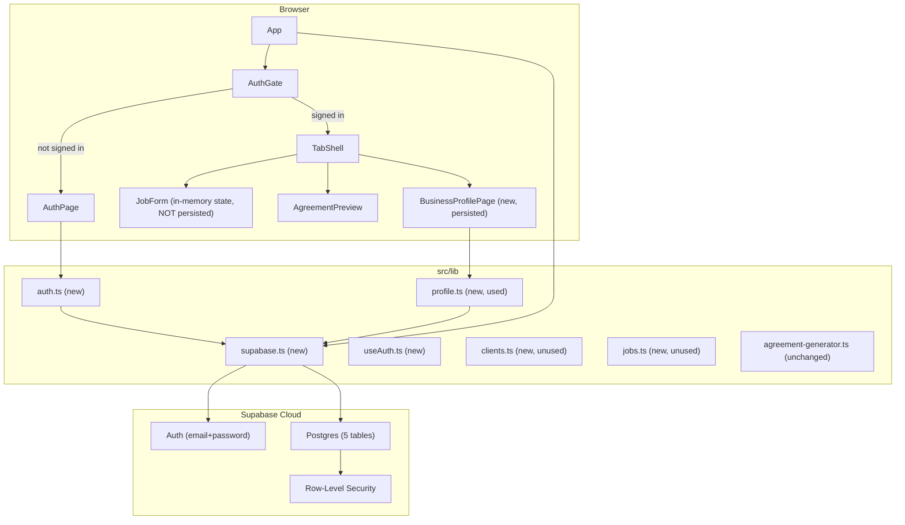

# ScopeLock – Supabase Backend Foundation (Master Plan)

## Scope

### What IS included (MVP-thin backend foundation):

1. Supabase project setup + local development configuration
2. Database schema with 5 tables (business_profiles, clients, jobs, change_orders, completion_signoffs)
3. Postgres indexes, triggers, RLS policies, cascade deletes
4. Email/password authentication flow (sign up, sign in, sign out)
5. Business profile persistence (onboarding + edit form wired to DB)
6. Contractor name auto-populated from saved profile in JobForm

### What is NOT included (future work):

- Client list UI (schema + helpers created, but no UI)
- Job persistence (schema + helpers created, but JobForm NOT wired to create/update jobs)
- Change order UI and logic
- Completion signoff UI and logic

## Architecture After This Change




## Implementation Strategy

This plan is split into **4 separate execution passes** to prevent scope creep and ensure each component can be tested independently before proceeding.

**Pass 1:** Supabase setup + environment configuration
**Pass 2:** Database schema with tables, indexes, triggers, RLS policies
**Pass 3:** Authentication flow (sign up, sign in, sign out)
**Pass 4:** Business profile persistence + contractor_name auto-fill

Each pass includes:

- Exact scope definition
- Files allowed to change vs. files to avoid
- Acceptance criteria
- Required end summary listing what works and what's incomplete

See detailed execution prompts below.

## Technical Requirements

### Database Schema Standards

All 5 tables MUST include:

- `id uuid primary key default gen_random_uuid()`
- `user_id uuid references auth.users not null`
- `created_at timestamptz default now()`
- `updated_at timestamptz default now()`
- Index on `user_id`: `CREATE INDEX idx_<table>_user_id ON <table>(user_id);`
- Index on all foreign key columns: `CREATE INDEX idx_<table>_<fk_col> ON <table>(<fk_col>);`
- `updated_at` trigger: use `moddatetime` extension or create custom `update_updated_at_column()` function
- RLS enabled with 4 separate policies (SELECT, INSERT, UPDATE, DELETE)
- Foreign keys with `ON DELETE CASCADE` where appropriate

### Field Types (Match Frontend WelderJob Interface)

**jobs table** must align with `/src/types/index.ts` WelderJob:

- `customer_name text not null`
- `customer_phone text not null`
- `job_location text not null`
- `job_type text not null` (repair | fabrication | mobile repair)
- `asset_or_item_description text not null`
- `requested_work text not null`
- `materials_provided_by text not null` (welder | customer | mixed)
- `installation_included boolean default false`
- `grinding_included boolean default false`
- `paint_or_coating_included boolean default false`
- `removal_or_disassembly_included boolean default false`
- `hidden_damage_possible boolean default false`
- `price_type text not null` (fixed | estimate)
- `price numeric(10,2) not null`
- `deposit_required boolean default false`
- `payment_terms text`
- `target_completion_date date`
- `exclusions text[]` (Postgres array, NOT jsonb)
- `assumptions text[]` (Postgres array, NOT jsonb)
- `change_order_required boolean default false`
- `workmanship_warranty_days integer` (NOT jsonb)
- `status text default 'draft'`
- `client_id uuid references clients(id) ON DELETE SET NULL` (nullable, cascade)

**business_profiles table:**

- `user_id uuid unique not null` (one profile per user)
- `business_name text not null`
- `owner_name text`
- `phone text`
- `email text`
- `address text`
- `google_business_profile_url text`

**clients table:**

- `name text not null`
- `phone text`
- `email text`
- `address text`
- `notes text`

**change_orders table:**

- `job_id uuid references jobs(id) ON DELETE CASCADE not null`
- `description text not null`
- `price_delta numeric(10,2)`
- `time_delta integer` (days)
- `approved boolean` (null = pending, true = approved, false = rejected)

**completion_signoffs table:**

- `job_id uuid references jobs(id) ON DELETE CASCADE unique not null`
- `client_name text not null`
- `signed_at timestamptz not null`
- `notes text`

### RLS Policy Pattern

Each table must have 4 separate policies (NOT a single catch-all policy):

```sql
ALTER TABLE <table> ENABLE ROW LEVEL SECURITY;

CREATE POLICY "select_own" ON <table> FOR SELECT
  USING (user_id = auth.uid());

CREATE POLICY "insert_own" ON <table> FOR INSERT
  WITH CHECK (user_id = auth.uid());

CREATE POLICY "update_own" ON <table> FOR UPDATE
  USING (user_id = auth.uid());

CREATE POLICY "delete_own" ON <table> FOR DELETE
  USING (user_id = auth.uid());
```

### Auth Configuration

- Email/password only (no OAuth)
- No email verification required (can enable later)
- Session stored in localStorage (Supabase default)

---

# EXECUTION PROMPTS

The following 4 prompts should be executed separately, in sequential order, by the implementation agent. Each pass should be committed and tested before proceeding to the next.

---

## EXECUTION PROMPT 1: Supabase Setup

**Objective:** Install Supabase CLI, initialize local dev environment, configure env vars.

### Scope

- Install dependencies
- Initialize Supabase project locally
- Configure environment variables
- Update .gitignore

### Files Allowed to Change

- `package.json`
- `.gitignore`
- `.env.example` (create)
- `.env.local` (create)
- `supabase/config.toml` (created by CLI)
- Other files created by `supabase init`

### Files NOT to Touch

- All files in `src/`
- `README.md` and `ARCHITECTURE.md`
- Any existing components

### Tasks

1. Install Supabase client library:

```bash
   npm install @supabase/supabase-js
   

```

1. Initialize Supabase project (creates supabase/ directory):

```bash
   supabase init
   

```

1. Create `.env.example` with placeholders:

```env
   VITE_SUPABASE_URL=your-project-url-here
   VITE_SUPABASE_ANON_KEY=your-anon-key-here
   

```

1. Create `.env.local` (copy from .env.example, add note that developer should fill in real values from Supabase dashboard)
2. Update `.gitignore`:

```gitignore
   .env.local
   supabase/.branches
   

```

### Acceptance Criteria

- `@supabase/supabase-js` in package.json dependencies
- `supabase/config.toml` exists
- `.env.example` and `.env.local` exist with VITE_SUPABASE_URL and VITE_SUPABASE_ANON_KEY
- `.gitignore` updated to exclude .env.local and supabase/.branches
- Can run `supabase status` without errors

### Required End Summary

Output exactly:

```
=== PASS 1 COMPLETE ===
Installed: @supabase/supabase-js
Created: supabase/config.toml, .env.example, .env.local
Updated: .gitignore

INCOMPLETE:
- Database schema not yet created
- Auth flow not yet implemented
- Business profile persistence not yet implemented
```

---

## EXECUTION PROMPT 2: Schema + Migration + RLS

**Objective:** Create complete database schema with all tables, indexes, triggers, RLS policies.

### Scope

- Write migration SQL file with all 5 tables
- Add indexes, triggers, RLS policies
- Create TypeScript type definitions
- Apply migration locally

### Files Allowed to Change

- `supabase/migrations/0001_initial_schema.sql` (create)
- `src/types/db.ts` (create)

### Files NOT to Touch

- All files in `src/lib/`
- All files in `src/components/`
- `src/App.tsx`
- Auth or UI files

### Tasks

1. Create `supabase/migrations/0001_initial_schema.sql` with:
  a. Enable required extensions:

```sql
   CREATE EXTENSION IF NOT EXISTS "moddatetime";
   

```

   b. Create all 5 tables with exact field types from "Technical Requirements" section above:
      - business_profiles (with user_id UNIQUE constraint)
      - clients
      - jobs (with all WelderJob fields)
      - change_orders
      - completion_signoffs

   c. Add indexes:

```sql
   CREATE INDEX idx_business_profiles_user_id ON business_profiles(user_id);
   CREATE INDEX idx_clients_user_id ON clients(user_id);
   CREATE INDEX idx_jobs_user_id ON jobs(user_id);
   CREATE INDEX idx_jobs_client_id ON jobs(client_id);
   CREATE INDEX idx_change_orders_user_id ON change_orders(user_id);
   CREATE INDEX idx_change_orders_job_id ON change_orders(job_id);
   CREATE INDEX idx_completion_signoffs_user_id ON completion_signoffs(user_id);
   CREATE INDEX idx_completion_signoffs_job_id ON completion_signoffs(job_id);
   

```

   d. Add updated_at triggers to all tables:

```sql
   CREATE TRIGGER handle_updated_at BEFORE UPDATE ON <table>
     FOR EACH ROW EXECUTE PROCEDURE moddatetime(updated_at);
   

```

   e. Enable RLS and create 4 policies per table (select_own, insert_own, update_own, delete_own) using pattern from "RLS Policy Pattern" section

   f. Use `ON DELETE CASCADE` for:
      - change_orders.job_id → jobs(id)
      - completion_signoffs.job_id → jobs(id)

   g. Use `ON DELETE SET NULL` for:
      - jobs.client_id → clients(id)

1. Create `src/types/db.ts` with TypeScript interfaces matching the schema:

```typescript
   export interface BusinessProfile {
     id: string;
     user_id: string;
     business_name: string;
     owner_name: string | null;
     phone: string | null;
     email: string | null;
     address: string | null;
     google_business_profile_url: string | null;
     created_at: string;
     updated_at: string;
   }

   export interface Client {
     id: string;
     user_id: string;
     name: string;
     phone: string | null;
     email: string | null;
     address: string | null;
     notes: string | null;
     created_at: string;
     updated_at: string;
   }

   export interface Job {
     id: string;
     user_id: string;
     client_id: string | null;
     customer_name: string;
     customer_phone: string;
     job_location: string;
     job_type: 'repair' | 'fabrication' | 'mobile repair';
     asset_or_item_description: string;
     requested_work: string;
     materials_provided_by: 'welder' | 'customer' | 'mixed';
     installation_included: boolean;
     grinding_included: boolean;
     paint_or_coating_included: boolean;
     removal_or_disassembly_included: boolean;
     hidden_damage_possible: boolean;
     price_type: 'fixed' | 'estimate';
     price: number;
     deposit_required: boolean;
     payment_terms: string | null;
     target_completion_date: string | null;
     exclusions: string[];
     assumptions: string[];
     change_order_required: boolean;
     workmanship_warranty_days: number | null;
     status: string;
     created_at: string;
     updated_at: string;
   }

   export interface ChangeOrder {
     id: string;
     user_id: string;
     job_id: string;
     description: string;
     price_delta: number | null;
     time_delta: number | null;
     approved: boolean | null;
     created_at: string;
     updated_at: string;
   }

   export interface CompletionSignoff {
     id: string;
     user_id: string;
     job_id: string;
     client_name: string;
     signed_at: string;
     notes: string | null;
     created_at: string;
     updated_at: string;
   }
   

```

1. Apply migration:

```bash
   supabase db reset
   

```

### Acceptance Criteria

- Migration file exists at `supabase/migrations/0001_initial_schema.sql`
- Migration applies without errors (supabase db reset succeeds)
- All 5 tables created with correct field types
- Indexes exist on user_id and all foreign keys
- updated_at triggers work (can test with manual INSERT then UPDATE)
- RLS policies enforce user_id = auth.uid() (4 policies per table, 20 total)
- TypeScript interfaces in src/types/db.ts match schema exactly

### Required End Summary

Output exactly:

```
=== PASS 2 COMPLETE ===
Created: supabase/migrations/0001_initial_schema.sql, src/types/db.ts
Tables: business_profiles, clients, jobs, change_orders, completion_signoffs
Indexes: 8 total (user_id + foreign keys)
Triggers: updated_at on all 5 tables
RLS Policies: 20 total (4 per table)

INCOMPLETE:
- Supabase client not yet created
- Auth flow not yet implemented
- Business profile persistence not yet implemented
```

---

## EXECUTION PROMPT 3: Auth Flow

**Objective:** Implement auth infrastructure and basic sign in/sign up UI.

### Scope

- Create Supabase client singleton
- Create auth helper functions
- Create useAuth React hook
- Create AuthPage component
- Wire AuthGate into App.tsx (no profile loading yet)

### Files Allowed to Change

- `src/lib/supabase.ts` (create)
- `src/lib/auth.ts` (create)
- `src/hooks/useAuth.ts` (create)
- `src/components/AuthPage.tsx` (create)
- `src/App.tsx` (add AuthGate wrapper only)

### Files NOT to Touch

- `src/lib/db/` (not yet created)
- `src/components/BusinessProfileForm.tsx` (not yet created)
- `src/components/JobForm.tsx`
- Migration files

### Tasks

1. Create `src/lib/supabase.ts`:

```typescript
   import { createClient } from '@supabase/supabase-js';

   const supabaseUrl = import.meta.env.VITE_SUPABASE_URL;
   const supabaseAnonKey = import.meta.env.VITE_SUPABASE_ANON_KEY;

   if (!supabaseUrl || !supabaseAnonKey) {
     throw new Error('Missing Supabase environment variables');
   }

   export const supabase = createClient(supabaseUrl, supabaseAnonKey);
   

```

1. Create `src/lib/auth.ts`:

```typescript
   import { supabase } from './supabase';

   export const signUp = async (email: string, password: string) => {
     const { data, error } = await supabase.auth.signUp({ email, password });
     return { data, error };
   };

   export const signIn = async (email: string, password: string) => {
     const { data, error } = await supabase.auth.signInWithPassword({ email, password });
     return { data, error };
   };

   export const signOut = async () => {
     const { error } = await supabase.auth.signOut();
     return { error };
   };
   

```

1. Create `src/hooks/useAuth.ts`:

```typescript
   import { useEffect, useState } from 'react';
   import { supabase } from '../lib/supabase';
   import type { User, Session } from '@supabase/supabase-js';

   export function useAuth() {
     const [user, setUser] = useState<User | null>(null);
     const [session, setSession] = useState<Session | null>(null);
     const [loading, setLoading] = useState(true);

     useEffect(() => {
       // Get initial session
       supabase.auth.getSession().then(({ data: { session } }) => {
         setSession(session);
         setUser(session?.user ?? null);
         setLoading(false);
       });

       // Subscribe to auth changes
       const { data: { subscription } } = supabase.auth.onAuthStateChange((_event, session) => {
         setSession(session);
         setUser(session?.user ?? null);
         setLoading(false);
       });

       return () => subscription.unsubscribe();
     }, []);

     return { user, session, loading };
   }
   

```

1. Create `src/components/AuthPage.tsx`:

```typescript
   import { useState } from 'react';
   import { signUp, signIn } from '../lib/auth';

   export function AuthPage() {
     const [isSignUp, setIsSignUp] = useState(false);
     const [email, setEmail] = useState('');
     const [password, setPassword] = useState('');
     const [error, setError] = useState('');
     const [loading, setLoading] = useState(false);

     const handleSubmit = async (e: React.FormEvent) => {
       e.preventDefault();
       setError('');
       setLoading(true);

       const { error } = isSignUp
         ? await signUp(email, password)
         : await signIn(email, password);

       if (error) {
         setError(error.message);
         setLoading(false);
       }
       // On success, useAuth will update and App will re-render
     };

     return (
       <div className="auth-page">
         <h1>{isSignUp ? 'Sign Up' : 'Sign In'}</h1>
         <form onSubmit={handleSubmit}>
           <input
             type="email"
             placeholder="Email"
             value={email}
             onChange={(e) => setEmail(e.target.value)}
             required
           />
           <input
             type="password"
             placeholder="Password"
             value={password}
             onChange={(e) => setPassword(e.target.value)}
             required
             minLength={6}
           />
           <button type="submit" disabled={loading}>
             {loading ? 'Loading...' : isSignUp ? 'Sign Up' : 'Sign In'}
           </button>
           {error && <p className="error">{error}</p>}
         </form>
         <button onClick={() => setIsSignUp(!isSignUp)}>
           {isSignUp ? 'Already have an account? Sign in' : "Don't have an account? Sign up"}
         </button>
       </div>
     );
   }
   

```

1. Update `src/App.tsx`:
  - Import `useAuth` and `AuthPage`
  - Wrap existing app logic:

```typescript
     const { user, loading } = useAuth();

     if (loading) {
       return <div>Loading...</div>;
     }

     if (!user) {
       return <AuthPage />;
     }

     // Existing app code (TabShell, etc.)
     

```

- Do NOT load business profile yet (that's Pass 4)

### Acceptance Criteria

- User can sign up with email/password
- User can sign in with email/password
- Auth state persists across page refreshes
- App shows loading spinner while checking auth
- App shows AuthPage when logged out
- App shows main TabShell when logged in
- No console errors

### Required End Summary

Output exactly:

```
=== PASS 3 COMPLETE ===
Created: src/lib/supabase.ts, src/lib/auth.ts, src/hooks/useAuth.ts, src/components/AuthPage.tsx
Updated: src/App.tsx (AuthGate wrapper)
Auth flow: sign up, sign in, sign out working
Session persistence: working

INCOMPLETE:
- Business profile database helpers not yet created
- Business profile UI not yet created
- contractor_name not yet auto-populated
```

---

## EXECUTION PROMPT 4: Business Profile Persistence

**Objective:** Wire business profile to database, create onboarding form, auto-populate contractor_name in JobForm.

### Scope

- Create business profile DB helpers
- Create stub client/job DB helpers (ready for future use)
- Create BusinessProfileForm component
- Wire profile loading into App.tsx
- Pass contractor_name from profile to JobForm

### Files Allowed to Change

- `src/lib/db/profile.ts` (create)
- `src/lib/db/clients.ts` (create)
- `src/lib/db/jobs.ts` (create)
- `src/components/BusinessProfileForm.tsx` (create)
- `src/App.tsx` (add profile loading, pass contractor_name)
- `src/components/JobForm.tsx` (ONLY if necessary to accept contractor_name as initial value)

### Files NOT to Touch

- Migration files
- Auth files (already complete)
- Agreement generation logic
- Other components

### Tasks

1. Create `src/lib/db/profile.ts`:

```typescript
   import { supabase } from '../supabase';
   import type { BusinessProfile } from '../../types/db';

   export const getProfile = async (userId: string): Promise<BusinessProfile | null> => {
     const { data, error } = await supabase
       .from('business_profiles')
       .select('*')
       .eq('user_id', userId)
       .single();

     if (error) {
       console.error('Error fetching profile:', error);
       return null;
     }

     return data;
   };

   export const upsertProfile = async (profile: Partial<BusinessProfile> & { user_id: string }) => {
     const { data, error } = await supabase
       .from('business_profiles')
       .upsert(profile, { onConflict: 'user_id' })
       .select()
       .single();

     return { data, error };
   };
   

```

1. Create `src/lib/db/clients.ts` (stub helpers for future use):

```typescript
   import { supabase } from '../supabase';
   import type { Client } from '../../types/db';

   export const listClients = async (userId: string): Promise<Client[]> => {
     const { data, error } = await supabase
       .from('clients')
       .select('*')
       .eq('user_id', userId)
       .order('created_at', { ascending: false });

     if (error) {
       console.error('Error listing clients:', error);
       return [];
     }

     return data;
   };

   export const upsertClient = async (client: Partial<Client> & { user_id: string }) => {
     const { data, error } = await supabase
       .from('clients')
       .upsert(client)
       .select()
       .single();

     return { data, error };
   };

   export const deleteClient = async (id: string) => {
     const { error } = await supabase
       .from('clients')
       .delete()
       .eq('id', id);

     return { error };
   };
   

```

1. Create `src/lib/db/jobs.ts` (stub helpers for future use):

```typescript
   import { supabase } from '../supabase';
   import type { Job } from '../../types/db';

   export const listJobs = async (userId: string): Promise<Job[]> => {
     const { data, error } = await supabase
       .from('jobs')
       .select('*')
       .eq('user_id', userId)
       .order('created_at', { ascending: false });

     if (error) {
       console.error('Error listing jobs:', error);
       return [];
     }

     return data;
   };

   export const createJob = async (job: Partial<Job> & { user_id: string }) => {
     const { data, error } = await supabase
       .from('jobs')
       .insert(job)
       .select()
       .single();

     return { data, error };
   };

   export const updateJob = async (id: string, job: Partial<Job>) => {
     const { data, error } = await supabase
       .from('jobs')
       .update(job)
       .eq('id', id)
       .select()
       .single();

     return { data, error };
   };

   export const deleteJob = async (id: string) => {
     const { error } = await supabase
       .from('jobs')
       .delete()
       .eq('id', id);

     return { error };
   };
   

```

1. Create `src/components/BusinessProfileForm.tsx`:

```typescript
   import { useState } from 'react';
   import { upsertProfile } from '../lib/db/profile';
   import type { BusinessProfile } from '../types/db';

   interface BusinessProfileFormProps {
     userId: string;
     initialProfile?: BusinessProfile | null;
     onSave: () => void;
   }

   export function BusinessProfileForm({ userId, initialProfile, onSave }: BusinessProfileFormProps) {
     const [businessName, setBusinessName] = useState(initialProfile?.business_name ?? '');
     const [ownerName, setOwnerName] = useState(initialProfile?.owner_name ?? '');
     const [phone, setPhone] = useState(initialProfile?.phone ?? '');
     const [email, setEmail] = useState(initialProfile?.email ?? '');
     const [address, setAddress] = useState(initialProfile?.address ?? '');
     const [googleUrl, setGoogleUrl] = useState(initialProfile?.google_business_profile_url ?? '');
     const [error, setError] = useState('');
     const [loading, setLoading] = useState(false);

     const handleSubmit = async (e: React.FormEvent) => {
       e.preventDefault();
       setError('');
       setLoading(true);

       const { error } = await upsertProfile({
         user_id: userId,
         business_name: businessName,
         owner_name: ownerName || null,
         phone: phone || null,
         email: email || null,
         address: address || null,
         google_business_profile_url: googleUrl || null,
       });

       setLoading(false);

       if (error) {
         setError(error.message);
       } else {
         onSave();
       }
     };

     return (
       <div className="business-profile-form">
         <h1>{initialProfile ? 'Edit Business Profile' : 'Set Up Your Business Profile'}</h1>
         <form onSubmit={handleSubmit}>
           <label>
             Business Name *
             <input
               type="text"
               value={businessName}
               onChange={(e) => setBusinessName(e.target.value)}
               required
             />
           </label>

           <label>
             Owner Name
             <input
               type="text"
               value={ownerName}
               onChange={(e) => setOwnerName(e.target.value)}
             />
           </label>

           <label>
             Phone
             <input
               type="tel"
               value={phone}
               onChange={(e) => setPhone(e.target.value)}
             />
           </label>

           <label>
             Email
             <input
               type="email"
               value={email}
               onChange={(e) => setEmail(e.target.value)}
             />
           </label>

           <label>
             Address
             <textarea
               value={address}
               onChange={(e) => setAddress(e.target.value)}
             />
           </label>

           <label>
             Google Business Profile URL
             <input
               type="url"
               value={googleUrl}
               onChange={(e) => setGoogleUrl(e.target.value)}
             />
           </label>

           <button type="submit" disabled={loading}>
             {loading ? 'Saving...' : 'Save Profile'}
           </button>

           {error && <p className="error">{error}</p>}
         </form>
       </div>
     );
   }
   

```

1. Update `src/App.tsx`:

```typescript
   import { useState, useEffect } from 'react';
   import { useAuth } from './hooks/useAuth';
   import { AuthPage } from './components/AuthPage';
   import { BusinessProfileForm } from './components/BusinessProfileForm';
   import { getProfile } from './lib/db/profile';
   import { signOut } from './lib/auth';
   import type { BusinessProfile } from './types/db';
   import type { WelderJob } from './types';
   import sampleJob from './data/sample-job.json';

   function App() {
     const { user, loading: authLoading } = useAuth();
     const [profile, setProfile] = useState<BusinessProfile | null>(null);
     const [profileLoading, setProfileLoading] = useState(true);
     const [editingProfile, setEditingProfile] = useState(false);
     const [activeTab, setActiveTab] = useState<'form' | 'preview'>('form');
     const [job, setJob] = useState<WelderJob>(() => ({
       ...(sampleJob as WelderJob),
       contractor_name: '',
     }));

     // Auto-populate contractor_name when profile loads
     useEffect(() => {
       if (profile && !editingProfile) {
         setJob((prev) => ({ ...prev, contractor_name: profile.business_name }));
       }
     }, [profile?.business_name, editingProfile]);

     // Load profile when user logs in
     useEffect(() => {
       if (user) {
         const loadProfile = async () => {
           setProfileLoading(true);
           const data = await getProfile(user.id);
           setProfile(data);
           setProfileLoading(false);
         };
         loadProfile();
       } else {
         setProfile(null);
         setProfileLoading(false);
       }
     }, [user]);

     const loadProfile = async () => {
       if (!user) return;
       setProfileLoading(true);
       const data = await getProfile(user.id);
       setProfile(data);
       setProfileLoading(false);
       setEditingProfile(false);
     };

     if (authLoading || profileLoading) {
       return <div className="app-loading">Loading...</div>;
     }

     if (!user) {
       return <AuthPage />;
     }

     if (!profile || editingProfile) {
       return (
         <BusinessProfileForm
           userId={user.id}
           initialProfile={profile}
           onSave={loadProfile}
         />
       );
     }

     return (
       <div className="app">
         <header className="app-header">
           <h1>ScopeLock</h1>
           <div className="header-actions">
             <button onClick={() => setEditingProfile(true)}>Edit Profile</button>
             <button onClick={() => signOut()}>Sign Out</button>
           </div>
         </header>
         <nav className="tab-nav">
           <button onClick={() => setActiveTab('form')}>Job Details</button>
           <button onClick={() => setActiveTab('preview')}>Agreement Preview</button>
         </nav>
         <main>
           {activeTab === 'form' ? (
             <JobForm job={job} onChange={setJob} />
           ) : (
             <AgreementPreview job={job} />
           )}
         </main>
       </div>
     );
   }


```

**Key Implementation Details:**

- Use `useEffect` to auto-populate `contractor_name` when profile loads
- Add `editingProfile` state to allow users to edit their profile after initial setup
- Include "Edit Profile" and "Sign Out" buttons in the header
- JobForm receives job state with pre-filled `contractor_name` from profile

### Acceptance Criteria

- ✅ User sees BusinessProfileForm on first login (no profile in DB yet)
- ✅ User can save business profile to database
- ✅ Profile persists and reloads on next session
- ✅ User can edit profile via "Edit Profile" button in header
- ✅ User can sign out via "Sign Out" button in header
- ✅ contractor_name field in JobForm is auto-populated with profile.business_name
- ✅ JobForm still works with in-memory state (jobs NOT saved to DB yet)
- ✅ Client and job DB helpers exist but are not called anywhere (ready for future use)
- ✅ Tab navigation between Job Details and Agreement Preview works
- ✅ No console errors
- ✅ Project builds successfully with `npm run build`

### Required End Summary

Output exactly:

```
=== PASS 4 COMPLETE ===
Created: src/lib/db/profile.ts, src/lib/db/clients.ts (stub), src/lib/db/jobs.ts (stub), src/components/BusinessProfileForm.tsx
Updated: src/App.tsx (profile loading + contractor_name auto-fill)

FULLY WORKING:
- Email/password auth (sign up, sign in, sign out)
- Business profile persistence (onboarding + edit)
- contractor_name auto-populated in JobForm from profile.business_name
- Database schema with 5 tables, indexes, triggers, RLS
- Typed DB helpers ready for future use

NOT WORKING (Future Tasks):
- Client list UI (helpers exist, no UI)
- Job persistence (helpers exist, JobForm still in-memory)
- Change orders (schema + types only)
- Completion signoffs (schema + types only)
```

---

# Final State After All 4 Passes

## ✅ Fully Working

### Authentication & User Management

- ✅ Email/password sign up and sign in
- ✅ Sign out functionality
- ✅ Session persistence across page refreshes
- ✅ Auth state management with useAuth hook
- ✅ Loading states during auth checks

### Business Profile

- ✅ Onboarding flow for new users (BusinessProfileForm on first login)
- ✅ Profile persistence to Supabase database
- ✅ "Edit Profile" button in app header
- ✅ Profile data reloads on subsequent sessions
- ✅ Auto-population of contractor_name in JobForm from saved profile

### Database & Infrastructure

- ✅ 5 database tables created: business_profiles, clients, jobs, change_orders, completion_signoffs
- ✅ Proper field types matching frontend (text[] for arrays, integer for warranty, individual booleans for included services)
- ✅ 8 indexes on user_id and foreign keys
- ✅ updated_at triggers on all tables (moddatetime extension)
- ✅ 20 RLS policies (4 per table: select, insert, update, delete)
- ✅ ON DELETE CASCADE for change_orders and completion_signoffs → jobs
- ✅ ON DELETE SET NULL for jobs → clients
- ✅ TypeScript interfaces matching schema in src/types/db.ts

### Application Features

- ✅ Tab navigation between "Job Details" and "Agreement Preview"
- ✅ JobForm with in-memory state (not persisted to DB)
- ✅ Agreement preview and PDF generation
- ✅ Responsive UI with existing styling

### Code Architecture

- ✅ Typed Supabase client (src/lib/supabase.ts)
- ✅ Auth helpers (src/lib/auth.ts)
- ✅ useAuth hook (src/hooks/useAuth.ts)
- ✅ DB helpers ready for future use:
  - ✅ src/lib/db/profile.ts (getProfile, upsertProfile) - **ACTIVELY USED**
  - ✅ src/lib/db/clients.ts (listClients, upsertClient, deleteClient) - **STUB**
  - ✅ src/lib/db/jobs.ts (listJobs, createJob, updateJob, deleteJob) - **STUB**

## ❌ Not Yet Implemented (Future Work)

### Client Management

- ❌ Client list UI (no component or route)
- ❌ Client CRUD operations in UI (helpers exist but not wired)
- ❌ Client selection in JobForm

### Job Persistence

- ❌ Saving jobs to database (JobForm still in-memory only)
- ❌ Loading saved jobs from database
- ❌ Job list/history view
- ❌ Job editing workflow

### Change Orders

- ❌ Change order UI and workflow
- ❌ Schema and helpers exist but not wired to UI

### Completion Signoffs

- ❌ Completion signoff UI and workflow
- ❌ Schema and helpers exist but not wired to UI

## Build Status

✅ Project builds successfully with `npm run build`
✅ No TypeScript errors
✅ No console errors in browser